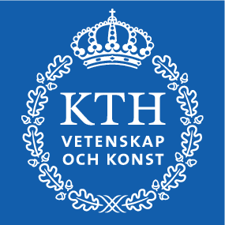

```python
%%html
<link rel="stylesheet" type="text/css" href="../flowmeeting2018.css">
<script>
    var link = document.createElement( 'link' );
    link.rel = 'stylesheet';
    link.type = 'text/css';
    link.href = window.location.search.match( /print-pdf/gi ) ? '../js/reveal.js-3.6.0/css/print/pdf.css' : '../js/reveal.js-3.6.0/css/print/paper.css';
    document.getElementsByTagName( 'head' )[0].appendChild( link );
</script>

```


<link rel="stylesheet" type="text/css" href="../flowmeeting2018.css">
<script>
    var link = document.createElement( 'link' );
    link.rel = 'stylesheet';
    link.type = 'text/css';
    link.href = window.location.search.match( /print-pdf/gi ) ? '../js/reveal.js-3.6.0/css/print/pdf.css' : '../js/reveal.js-3.6.0/css/print/paper.css';
    document.getElementsByTagName( 'head' )[0].appendChild( link );
</script>


<br/><br/><br/><br/>

# A two-dimensional toy model for geophysical turbulence


 Erik Lindborg\*, Pierre Augier^, **Ashwin Vishnu Mohanan\***

<small>* Linne Flow Center, Department of Mechanics, KTH, Stockholm, Sweden</small><br/>
<small>^ LEGI / CNRS, Université Grenoble Alpes, Grenoble, France</small>


<div align="right">
 &nbsp; &nbsp;

</div>

<div align="right">
<font color="gray">
<small>
6 March 2018 (11:15 - 12:15 hrs), MISU <br/>
Stockholm University, Stockholm, Sweden
</small>
</font>
</div>
* Good evening all!
* I am here to talk about **how to modify** the shallow water equations for **turbulence studies**
* This work has been a **culmination of the efforts** from Pierre, who is sitting right there, Erik, and myself Ashwin

## Related research
 1. **Augier, P., Mohanan A.V. & Lindborg, E.** *Wave energy cascade in forced-dissipative one-layer shallow-water flows.* **J. Fluid Mech. (to be submitted)**.

 1. **Lindborg, E. & Mohanan, A. V.** *A two-dimensional toy model for geophysical turbulence.* **Phys. Fluids (2017)**.

Article [2] selected as featured research by AIP (Nov 22, 2017)
<div>

</div>
* Here, I have **listed the articles** related to this talk
* Pleased to annouce that - **distinction** of being featured among several AIP publications once a week. 

## 1. Background
#### 1.1. Atmospheric energy spectra from aircraft data: Nastrom and Gage (1985)
<div  align="center">

</div>

* Synoptic scale spectra ($\lambda > 1000$ km) ~  $k^{-3}$
* Mesoscale spectra ($\lambda = 1$ to $500$ km) ~ $k^{-5/3}$

* **Picture in front of** you is the result of **aircraft measurements** in the atmosphere accumulated over several years
* Planetery scale and mesoscale
* Why does this happen? There are several answers...

## 1. Background
#### 1.2. Possible explanations for the mesoscale energy  $k^{-5/3}$ spectra


* **Gage (1979) & Lilly (1983)**: *inverse energy cascade* as in **Kraichnan (1967)**

* **Dewan (1979)**:*forward energy cascade* as in **Kolmogorov (1941)**

###### Theoretical predictions for turbulent structures involved
* **Lindborg (2006)** and **Waite & Bartello (2004)**: Stratified turbulence result in thin elongated structures. Vertical length scale $ l_v \sim u/N \approx 1 km$ 

* **Callies, Bühler and Ferrari (2016)**: Inertia gravity waves, with frequency $\omega \approx f$. i.e. $l_v \approx$ 100 metres.

* **Kraichnan**: Inverse ener. E(k) ~ k^{-5/3} & Forward ens.: E(k)~k^{-3}
* Emerging consensus that it could be explained by downscale or forward energy cascade.
* Theories tried to **estimate the type of vertical structures** and **quantify the length scale**
* Lindborg and Waite & Bartello in seperate studies attributed this to **elongated structures** (zig-zag instability) estimated to be bands of **1 km**
* Callies et al. pointed out this could be because of gravity waves **few metres**
* That raises the question is there is a minimum **Vertical resolution?** to get the mesoscale spectra?

## 1. Background
#### 1.3. Quick recap of turbulence fundamentals


 * Kinetic ($E_K$) and Available Potential Energy ($E_A$)
 * Transfer terms and Spectral energy fluxes
<div align="center">

</div>
 * Normal mode decomposition (for Bousinessq and shallow-water equations)
   - Velocities and the scalar can be decomposed as a sum of **one vortex** mode and **two wave** modes

## 1. Background
#### 1.3. Stratified Turbulence


 * **Lindborg (2006)**: Postulated scaling laws for non-rotating stratified turbulence

   - Length scale:
     - $l_v \sim u/N$
     - $\frac{l_v}{l_h} \sim F_h$, the horizontal Froude number. Typically $F_h << 1$ for strong stratification.
   - Energy spectrum:
     - $E_K(k_h) = C_1 \epsilon_K^{2/3}k_h^{-5/3}$;
     - $E_A(k_h) = C_2 \epsilon_P \epsilon_K^{-1/3}k_h^{-5/3}$
   - Forward energy cascade: $\Pi > 0$


## 1. Background
#### 1.3. Stratified Turbulence

<div align="right">
 &nbsp;

</div>
3D Boussinesq equation simulations in **Lindborg (2006)** demonstrated that
* energy spectra scales as $k^{-5/3}$
* energy flux indicates a **forward energy cascade**


## 1. Background
#### 1.4. Results from General Circulation Models


 * **Augier & Lindborg (2013)**: A GCM called **AFES** can simulate mesoscale energy cascade with coarse vertical resolution: 24 levels!
 * Other GCMs (ECMWF) cannot!
 * Energy spectra and fluxes computed from spherical harmonics . Spherical harmonic indices $l$ & $m$ correspond to latitude and longitude angles.


 * Scalar product of two vector fields: $<\bf{a}.\bf{b}> = \sum\limits_{l \geq 1} \sum\limits_{-l\leq m\leq l} (\bf{a},\bf{b})_{lm}$
<div align="right">
 &nbsp;

</div>
* Fact: **GCM such as AFES** able to **reproduce mesoscale spectra** with very few pressure levels
* **l < 3** ( planetary scales) APE is forced; l 
* **l = [8, 30]** baroclinic instability: conversion from APE -> KE. reflected also in green $C_{cum}$ curve
* **l > 50** reasonably flat energy flux -> inertial range and some 
energy goes upscale
* **l < 10** inverse energy cascade: source of large scale circulations

## 1. Background
#### 1.4. Motivation for the present study

#### Questions and contradictions

* Stratified turbulence predicts a fine vertical resolution to be needed for obtaining $k^{-5/3}$ spectra
* GCM simulations required only 24 pressure levels


<br/>

* Minimum number of levels required to reproduce $k^{-5/3}$ spectra?
* Is it possible with a single level model? **1-layer Shallow-water equation?**

* How many levels do we need in the **vertical**?
* Most **extreme** case: the shallow water equations?

## 2. Quest for the simplest model

##### Why shallow-water equations?
$$\frac{\partial {\bf u}} {\partial t} + {\bf u}\cdot \nabla{\bf u} +  f {\bf e}_z \times {\bf u} = -c^2 \nabla \eta $$
$$\frac{\partial \eta}{\partial t}+ {\bf u} \cdot \nabla \eta   = - (1+\eta) \nabla \cdot {\bf u}$$

* Explain many geophysical phenomena, including waves

* Conserves potential vorticity and enstrophy.

##### Why not shallow-water equations?

* Kinetic energy is not quadratic, but cubic: $E_K = (H + \eta) \frac{\mathbf{u}.\mathbf{u}}{2}$
* Potential enstrophy is not quadratic in general.
* Tendency for waves to develop into shocks giving rise to $k ^ {-2}$ energy spectra

* For those who are unfamiliar, SWE solves for horizontal velocity vector $\bf{u}$ (momentum conservation) and non-dimensional surface displacement ${\eta}$ (mass conservation)
* Many **good properties**
* **Not suitable for turbulence** studies... why?
* Reason: inability to represent K.E. and Pot. Enstrophy in **quadratic form**
* More importantly: **Shocks** result in $k^{-2}$, not $k^{-5/3}$ spectra

## 2. Quest for the simplest model
#### 2.1 Quasi-Geostrophy (QG): **Charney (1971)**

  - In QG limit, potential vorticity can be approximated as $ Q = \frac{f +\zeta }{1+\eta} \rightarrow q = \zeta + \beta y - f_0\eta$. Thus QG potential enstrophy, $\Omega = \frac{1}{2} q^2$ is quadratic.
  - Inverse energy cascade and forward enstrophy cascade: just like 2D turbulence in **Kraichnan (1971)**.

Shallow water equation is often studied as QG equations:

$$\frac{D}{Dt}\left(\nabla^2 \psi + \beta y - \frac{1}{L_d^2} \psi \right)= \frac{D}{Dt}\left(\zeta + \beta y - f_0 \eta \right)=0$$

Important assumptions:

1. Rossby number, $Ro < 1 \implies$ strong rotation
2. Burger number, $1 / Bu = L_d / L < 1 \implies$ planetary scales
3. Variations in coriolis term ($\beta$) is small $\implies$ mid-latitudes and above


## 2. Quest for the simplest model
#### 2.3 Desirable properties for turbulence studies


* Kinetic energy (KE) and Available potential energy (APE) should be **quadratic** and **conserved**
* Potential enstrophy conservation in the QG limit
* No shock formation

* Energies must be **conserved** in the **quadratic** form
* **Potential enstrophy** conservation in the QG limit
* **No shocks**!

$$\require{color} \newcommand{\red}[1]{\mathbin{\textcolor{red}{#1}}} \newcommand{\green}[1]{\mathbin{\textcolor{green}{#1}}}$$

## 2. Quest for the simplest model

#### 2.4. Motivations for the Modifications: **(Lindborg and Mohanan 2017)**

$$\frac{\partial {\bf u}} {\partial t} + {{\bf u}\cdot \nabla} {\bf u} +  f {\bf e}_z \times {\bf u} = -c^2 \nabla \eta $$
$$\frac{\partial \eta}{\partial t}+ {{\bf u} \cdot \nabla} \eta   = \red{- (1+\eta) \nabla \cdot {\bf u}}$$


* **Assumption #1**: *Surface displacement much smaller compared to the mean fluid layer height,* $\eta << 1$. 
<br/><br/>
<div align="left">
&nbsp;Replace &nbsp;$ \red{-(1+\eta) \nabla \cdot  {\bf u}}$  &nbsp; with  &nbsp; $ \green{-\nabla \cdot {\bf u}} $
</div>
<br/>


## 2. Quest for the simplest model

#### 2.4. Motivations for the Modifications: **(Lindborg and Mohanan 2017)**

$$\frac{\partial {\bf u}} {\partial t} + \red{{\bf u}\cdot \nabla} {\bf u} +  f {\bf e}_z \times {\bf u} = -c^2 \nabla \eta $$
$$\frac{\partial \eta}{\partial t}+ \red{{\bf u} \cdot \nabla} \eta   = \green{-\nabla \cdot {\bf u}}$$

* **Assumption #2**: *Velocities in the large scale are dominated by rotational part,* $ \bf u_r >> \bf u_d $.
<br/>
<div align="left">
<br/>
&nbsp;Replace &nbsp; $\red{{\bf u} \cdot \nabla}$&nbsp;  with &nbsp;
$\green{{\bf u_r} \cdot \nabla}$ 
</div>

While maintaining, $|\zeta| \sim |d|$ in contrast with QG where $|\zeta| >> |d|$ 

## 2. Quest for the simplest model

#### 2.4. Motivations for the Modifications

**Helmholtz decomposition:**
<div align="center">
${\bf u} = \bf{u}_r + \bf{u}_d$
</div>
<br/>
 * $ {\bf u}_r  = -\nabla \times ( {\bf e_z} \Psi)$ is the rotational component
 * $\bf {u}_d = \nabla \chi$ is the divergent component
 
with $\Psi$ and $\chi$ being the **stream function** and the **velocity potential** respectively.

Apply two modifications on the classical shallow water equations
* replace the right hand side of the scalar equation to make it **linear**. Reason: \eta << 1 when **Fr -> 0**
* in the **advection term** we use **rotational velocity**. Reason: **large scale motions** dominated by rotation
* use **Helmholtz decomposition** to calculate u_r

## 2. Quest for the simplest model
#### 2.5.  The toy model equations

$$\frac{\partial {\bf u}} {\partial t} + \green{{\bf u}_r\cdot \nabla} {\bf u} + f {\bf e}_z\times {\bf u} = -c \nabla \theta $$
$$\frac{\partial \theta}{\partial t}+ \green{{\bf u}_r \cdot \nabla} \theta   = -  c\green{\nabla \cdot {\bf u}} $$

where, $\theta = c\eta$


* **Pros**: No shocks, KE and APE are quadratic and conserved, linearised potential vorticity conserved in the limit $Ro \rightarrow 0$: $q = \zeta - f\eta$

* **Cons**: Full potential vorticity $Q$ is not exactly conserved

$$\require{color}$$
$$\newcommand{\red}[1]{\mathbin{\textcolor{red}{#1}}}$$
$$\newcommand{\green}[1]{\mathbin{\textcolor{green}{#1}}}$$

* **Putting in the assumptions** mentioned earlier, we get the toy-model
* Replaced \eta with a proportional \theta variable. Takes the form of potential temperature.
* Advantages and disadvantages

## 3. Results

#### 3.0 Numerical Simulations


## 3. Results

#### 3.1 Divergence fields ($\nabla\cdot\bf{u}$)
Shallow-water equations and toy model: forcing at $k_f = 6$


* Shocks appear as **sharp thin fronts** with **negative divergence**
* Divergence field (also related to vertical velocity)
* In toy model, **alternating bands** -> waves!

## 3. Results

#### 3.2 Energy spectra and spectral energy fluxes
Toy model forced at $k_f = 6$

<div>
 &nbsp;
 
</div>
* Wave spectra scales as k^{-5/3}, forward energy cascade, dominates
* Vortex spectra scales as k^{-3}, forward enstrophy cascade
* Tendency for inverse energy cascade

## 3. Results

#### 3.3 Energy spectra
Toy model forced at $k_f = 6$ using different forcing methods

<div>
 &nbsp;
</div>
## 3. Results

#### 3.4 Spectral energy fluxes
Toy model forced at $k_f = 6$ using different forcing methods

<div>
 &nbsp;
</div>
## 3. Results

#### 3.5 Spectral energy fluxes
Toy-model forced at $k_f = 30$ compared to GCM results from **Augier & Lindborg(2013)**
<div>
 &nbsp;

</div>
* Similar as before, only **difference is the forcing wavenumber**
* Toy model demonstrates **similar energetics** compared to **GCM**
* **Conversion** from APE to KE, **forward** cascade and **inverse** cascade of K.E.
* **Difference: equipartition** of K.E. and A.P.E. in smaller scales signifying waves. Not present in GCM.

## 3. Results

#### 3.6 Energy spectra
Toy model forced at $k_f = 30$


* **Stronger inverse cascade**, with vortical energy dominating at **larger scales**
* Smaller scales, wave and vortex spectra scale (approx) as before.
* **Ripples** appear when **coherent vortices** begin to form

## 3. Results

#### 3.7 Potential vorticity ($q$) and wave ($a_+$) fields
Toy model forced at $k_f = 30$

<div align="right">
<video width="90%" controls autoplay loop>
  <source src="./fig/agu_run3.mp4" type="video/mp4">
</video>
</div>
* Notice the coherent vortices form
* Waves form around vortices, strong interactions

## 3. Results

#### 3.8 Potential vorticity ($q$) and wave ($a_+$) fields: Anticyclone formation
Toy model forced at $k_f = 30$


* Presence of a **cyclonic core**, surrounded by a strong **anti cyclonic filaments** around it
* Also note, the **waves** gathering around the vortex

## 4. Outlook
<br/>
1. Toy model simulations in **beta plane**
1. Large simulation of the toy model over a **sphere**
1. Study of **cyclonic/anticyclonic assymetry** using the toy model

<br/>
<div align="center"><h1>Thank you for your attention!</h1></div>

##### Open source and reproducible
<div>
 <b> Mohanan, A. V., Bonamy C. & Augier, P.</b> FluidSim: modular, object-oriented Python package for CFD simulations  (to be submitted) |  Bitbucket <a href="https://bitbucket.org/fluiddyn/fluidsim">fluiddyn/fluidsim</a> | Github <a href="https://github.com/fluiddyn/fluidsim">fluiddyn/fluidsim </a>
<div align="right">
  &nbsp;
</div>
</div>

##### Summary
 * Toy model developed by adding two modifications to the 1-layer shallow water equations.
 * Able to reproduce $k^{-5/3}$ energy spectra similar to atmospheric mesoscale spectra.
 * Conserves K.E., A.P.E. and linear potential enstrophy in the quadratic form: useful in turbulence studies.
 * Further reading: **Lindborg, E. & Mohanan, A. V.** *A two-dimensional toy model for geophysical turbulence.* **Phys. Fluids (2017)**
<div align="right">
<font color="gray">
<small>
CC-BY-SA: <a href="https://kth.se/profile/avmo">Ashwin Vishnu Mohanan</a>
</small>
</font>
</div>
* The work here has been made using **fully open source** code
* I have **summarized** the talk in this slide
* Will be happy to take any **questions**
* Thank you all for your **attention**
