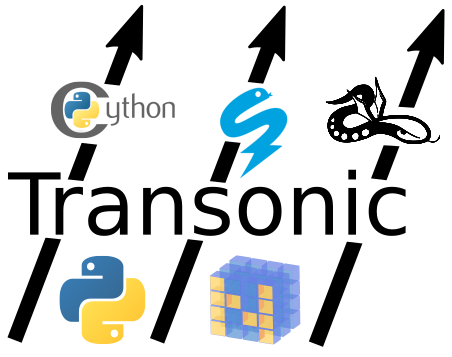
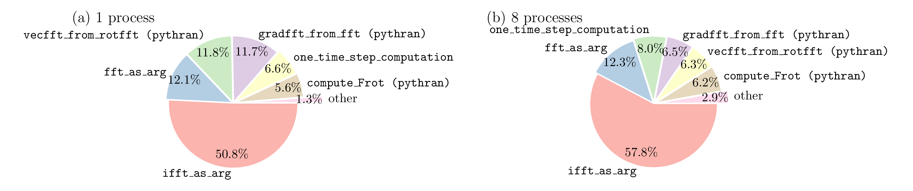
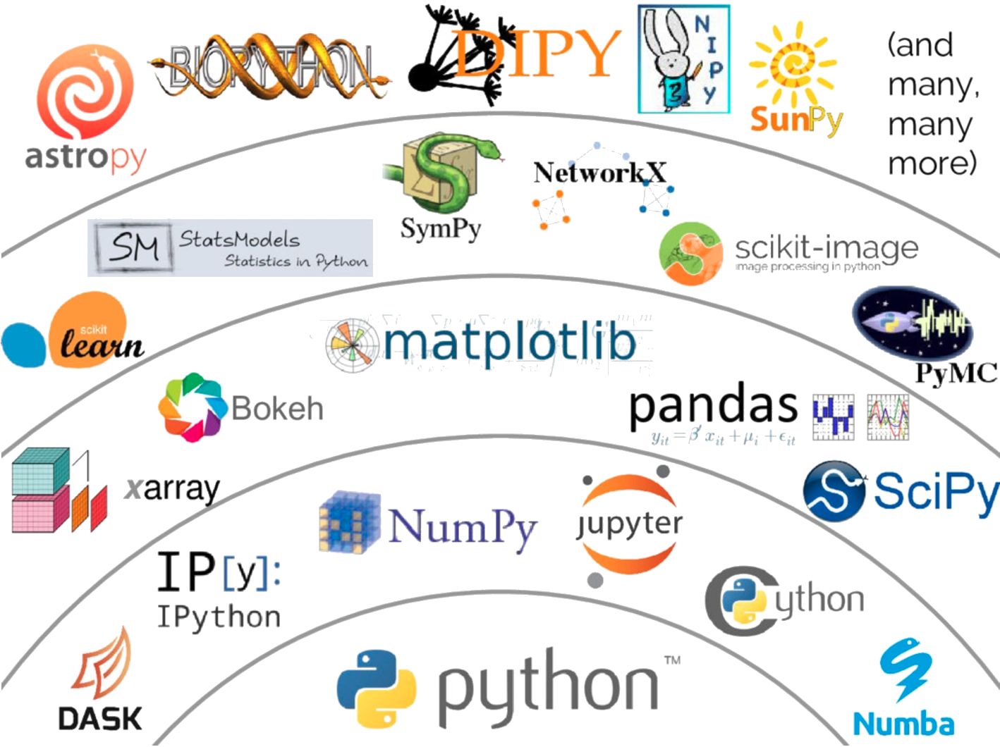

class: center, middle

# Make your Python code fly at _transonic_ speeds!



## [transonic.readthedocs.io](https://transonic.readthedocs.io)


<div style="font-size: 0.8em;">
<a rel="license" href="http://creativecommons.org/licenses/by/4.0/"></a>&nbsp;
This presentation is licensed under a 
<a rel="license"
href="http://creativecommons.org/licenses/by/4.0/">Creative Commons Attribution
4.0 International License</a>
</div>

???

- Good afternoon all!
- Now I will present my talk titled ...
- Thank: SU for the opportunity to come here

---

.pull-left[
## `$ who`

we are


- **Ashwin Vishnu Mohanan ([ashwinvis.github.io](https://ashwinvis.github.io)**)
  - Postdoctoral researcher, SU
  - Ph.D. in Engineering Mechanics, KTH
-  Pierre Blanc-fatin
  - Graduate student, Université Grenoble Alpes
- Pierre Augier
  - CNRS researcher, LEGI, Université Grenoble Alpes

]
.pull-right[

## `$ whoami`

- Researcher: Computational fluid dynamics of atmospheric flows

- Python user / core developer of [FluidDyn project](https://fluiddyn.rtfd.io) (including [`transonic`](https://transonic.rtfd.io))


]

???

- My **name** is Ashwin
- We are a **group of researchers** with focus on CFD: FluidDyn Project
- Heavy **users** of Python
- **Transonic**: 
  - born out of the necessities of writing high-performance code
  - collaboration between KTH and SU
- **

---

layout: false

# Overview

.left-column[

## `$ users`

]
.right-column[

.pull-left[

## this talk is meant for


]
.pull-right[
```python

if input("I ...") in (
    "use NumPy a lot",
    "write Python extensions"
    "write CPU-intensive codes",
    "think my Python codes are slow"
):
    print("Yes, this talk is for you!")
else:
    print("It is probably useful... :)")

```
]

]

???

- Show of hands if...

---

# Overview

.left-column[

## `$ users`
## `$ less`

]

.right-column[

## The short version of this talk

1. Whether, when and how to optimize Python code

1. Solutions exist, but also a "paradox of choice": (`cython`, `pythran`,
   `numba`, and many more...)

1. [`transonic`](https://transonic.readthedocs.io), a new pure-Python package,
   a unifying front-end for generating extensions and simplifying development

]

---

class: center, middle, inverse

# Brief guide on writing<br/> optimized, maintainable Python code

---
layout: false
.left-column[
  ## Should you optimize?
]
.right-column[
- Balance between _runtime efficency_ and _cost of development_

- Do not optimize everything

> Premature Optimization Is the Root of All Evil - _D. Knuth_

- CPU-bound or I/O-bound?

- Measure ⏱ , don't guess! **Profile** to find the bottlenecks
  - `python -m cProfile --help`

- Use efficient **algorithms** and **data structures**

- Test driven development to maintain correctness

]

???
- Python's good design decision: emphasis on **readability**. At a cost of
  **performance**.
- Real world problems: do not need a lot of optimization
- CPU bound: most of runtime spent in CPU: eg. linear algebra, calculus,
  statistics
- I/O bound: in communications: web development
- cProfile: TODO: example?
- Optimize logic
- If you should optimize, write unit-tests before you start.


---

.left-column[
  ## Should you optimize?
  ## Optimize hotspots
]
.right-column[
- **Interface**: with existing C / C++ / Fortran libraries,
  - in another language (`pybind11`, `PyO3`, `Boost.Python`, `SWIG`, ...)

  - in a "Pythonic" approach (`ctypes`, `cffi`, `Cython`, `numpy.f2py`, ...)

- **Extend**: write Python and generate extensions, which are compiled,
  - _Ahead of Time_ AOT: `Cython`, `Pythran`,...

  - _Just in Time_ JIT: `Numba`, ...

- Set yourself a goal, say: .red[*]

> 80 percent of the runtime is spent in 20 percent of the source code - _S. Meyers_




.footnote-cite[.red[*]
  <span style="font-variant:small-caps;">Mohanan, A. V., Bonamy, C., Linares, M. C., and Augier, P.</span> 2019 FluidSim: Modular, Object-Oriented Python Package for High-Performance CFD Simulations <i>J. Open Res. Softw.</i>, <b>7</b>, 14. doi:<a href="https://doi.org/10.5334/jors.239">10.5334/jors.239</a>
  <span class="Z3988" title="url_ver=Z39.88-2004&amp;ctx_ver=Z39.88-2004&amp;rfr_id=info%3Asid%2Fzotero.org%3A2&amp;rft_id=info%3Adoi%2F10.5334%2Fjors.239&amp;rft_val_fmt=info%3Aofi%2Ffmt%3Akev%3Amtx%3Ajournal&amp;rft.genre=article&amp;rft.atitle=FluidSim%3A%20Modular%2C%20Object-Oriented%20Python%20Package%20for%20High-Performance%20CFD%20Simulations&amp;rft.jtitle=Journal%20of%20Open%20Research%20Software&amp;rft.volume=7&amp;rft.issue=1&amp;rft.aufirst=Ashwin%20Vishnu&amp;rft.aulast=Mohanan&amp;rft.au=Ashwin%20Vishnu%20Mohanan&amp;rft.au=Cyrille%20Bonamy&amp;rft.au=Miguel%20Calpe%20Linares&amp;rft.au=Pierre%20Augier&amp;rft.date=2019-04-26&amp;rft.pages=14&amp;rft.issn=2049-9647&amp;rft.language=en"></span>
]

]

???
- Two path ways:
  1. **interface** with existing libs with or without Python
  2. **extend** code: AOT/JIT
- Set a target: good starting point
- Example: fluidsim. > 97% runtime spent in compiled functions

---

.left-column[
  ## Should you optimize?
  ## Optimize hotspots
  ## Optimized at which levels?
]
.right-column[
.pull-left[
-  whole programs (Nuitka, Shed Skin) 

-  interpreter compiling slowest loops (PyPy)

-  **modules (`cython`, `pythran`)**

-  **user-defined functions / methods (`numba`, `transonic`)**

-  **blocks of code (`transonic`)**

-  expressions (`numexpr`)

-  call compiled functions (`numpy` / Python)
]
.pull-right[


]

]

???
Software design perspective, optimize at different levels:

- programs, interpreters, modules, functions, code blocks, expressions, calls

---

.left-column[
  ## Should you optimize?
  ## Optimize hotspots
  ## Optimized at which levels?
  ## Two-language ~~problem~~ power!
]
.right-column[
  


  This strategy,
  - is the foundation for the **scientific Python ecosystem**

  - avoided _reinventing the wheel_
    

  - means as a developer ...
]

???
- basis of the Scientific Python ecosystem
- but it also means, as a developer...

---

class: center, middle, inverse

# Several design choices!

???
- there are hard decisions to make

---

background-image: url(images/graph.svg)
background-size: contain
class: background

???
A variety of Python accelerators exists.
Different ...
  * levels of optimization.
  - implementation details
  * targets for generating machine code.


---

background-image: url(images/graph_gray.svg)
background-size: contain
class: background

???
Focus on transonic. With v0.4.0 we support 3 backends, with most common
features implemented
  - Pythran
  - Cython
  - Numba

---

class: center, middle, inverse

# Enter: Transonic!


<div align="middle">
    <a href="https://transonic.readthedocs.io">transonic.readthedocs.io</a>    
</div>

???
which begs the question...

---

# What is Transonic, anyway?

.left-column[
<p><a href="https://commons.wikimedia.org/wiki/File:FA-18_Hornet_breaking_sound_barrier_(7_July_1999).jpg#/media/File:FA-18_Hornet_breaking_sound_barrier_(7_July_1999).jpg"></a>
</p>

]
.right-column[

> /trænˈsɑnɪk/ _adj._ just below, or just above the speed of sound .red[*]

Pure Python package (>= 3.6) to easily _accelerate_ modern Python+Numpy code

- Static analysis of extended Abstract Syntax Tree (AST) a.k.a. Full Syntax Tree
  (FST) using `beniget` and `transonic.extast`.

- Generates code for different backends: `cython`, `pythran`, `numba`.
  Keep your Python-Numpy code "clean and natural" 🧘

- Clean **type annotations** (🐍 3)

- Easily **mix** Python code and compiled functions

- Ahead-of-time (**AOT**) and just-in-time (**JIT**) modes

- **JIT for AOT** compilers (especially for Pythran)

- Accelerate **functions**, **methods** (of classes) and **blocks** of code

]

.footnote-cite[

.blue[*] image: <a href="https://commons.wikimedia.org/wiki/File:FA-18_Hornet_breaking_sound_barrier_(7_July_1999).jpg">
Ensign John Gay, U.S. Navy</a>

.red[*] source: [wiktionary.org](https://en.wiktionary.org/wiki/transonic)

]

???
> Wordplay: on transpiling and our background in fluid mechanics. Sound barrier
> an analogy for speed of native code.

- a powerful analyzer and thin runtime layer
- different backends
- no boilerplate
- type hints
- no unnecessary modules: like `cython` and `pythran`
- both AOT and JIT, even if JIT is not supported <!-- FIXME: JIT for Cython? --->
- accelerate from functions and methods - focus of this talk.


---

class: center, middle, inverse

# Few Transonic code examples

The following codes can be accelerated with Pythran, Cython and Numba.

???
Take a look at a few examples...

---

### Ahead-of-time (AOT) compilation

```python
import numpy as np

from transonic import boost

T0 = "int[:, :]"
T1 = "int[:]"

@boost
def row_sum(arr: T0, columns: T1):
    return arr.T[columns].sum(0)

@boost(boundscheck=False, wraparound=False)
def row_sum_loops(arr: T0, columns: T1):
    # locals type annotations are used only for Cython
    i: int
    j: int
    sum_: int
    res: "int[]" = np.empty(arr.shape[0], dtype=arr.dtype)
    for i in range(arr.shape[0]):
        sum_ = 0
        for j in range(columns.shape[0]):
            sum_ += arr[i, columns[j]]
        res[i] = sum_
    return res
```

AOT extensions can be produced via `setuptools` or using `transonic` CLI tool.

???

Example for
- a vectorized numpy code and a version with loops
- recently we also support type-hints for `memview`

Build using 
- `setuptools` with `setup.py`
- `transonic` CLI


---

### Ahead-of-time (AOT) compilation: how it works


```sh
❯ transonic -b python row_sum_boost.py
❯ transonic -b cython row_sum_boost.py
❯ transonic -b numba row_sum_boost.py
❯ transonic -b pythran row_sum_boost.py -af "-march=native -DUSE_XSIMD"
```

Transpiles and compiles (except for `python` and `numba` backends).
<pre>
<code>
├── __cython__
│   ├── build
│   │   └── temp.linux-x86_64-3.7
│   │       └── row_sum_boost_6b289bee8997c169d42490e866e21dbd.o
│   ├── row_sum_boost_6b289bee8997c169d42490e866e21dbd.cpython-37m-x86_64-linux-gnu.so
│   ├── row_sum_boost.pxd
│   └── row_sum_boost.py
├── __numba__
│   ├── row_sum_boost_31eb1043ac479242f9e0bada0fb8eb54.py
│   └── row_sum_boost.py
├── __python__
│   ├── row_sum_boost_ec5f7fc916224570e5f3daada7586404.py
│   └── row_sum_boost.py
├── __pythran__
│   ├── row_sum_boost_96475812cecd0831dffa8a52d385765c.cpython-37m-x86_64-linux-gnu.so
│   ├── row_sum_boost.py
│   └── row_sum_boost.pythran
└── row_sum_boost.py
</code>
</pre>

---

### Just-in-time compilation

```python
import numpy as np

from transonic import jit

def add(a, b):
    return a + b

@jit
def func(a, b):
    return np.exp(a) * b * add(a, b)
```

???

<!-- FIXME: how it works part-->

---

### Type annotations

From simple type-hints...

```python
import h5py

from transonic import boost


@boost
def myfunc(a: int, b: float):
    return a * b
```

... to more advanced **fused types** / **generic programming** / **polymorphism**


```python
import numpy as np
from transonic import Type, NDim, Array, boost

T = Type(int, float, np.complex128)  # dtype can be int, float or complex
N = NDim(1, 2, 3)  # dimensions of array can be 1, 2, or 3

A = Array[T, N]
A1 = Array[np.float32, N + 1]

@boost
def compute(a: A, b: A, c: T, d: A1):
    ...
```

???

- `import h5py`: not transpiled, dead code removal

---

### `inline` functions

Useful for Cython

```python
from transonic import boost

T = int

@boost(inline=True)
def add(a: T, b: T) -> T:
    return a + b

@boost
def use_add(n: int = 10000):
    _: int
    for _ in range(n):
        tmp = add(tmp, 1)
    return tmp

```

???

FIXME: show how it produces

---

### Accelerate methods of classes

```python
from transonic import boost

@boost
class MyClass:
    attr: int
    
    @boost
    def numerical_kernel(self, arg: int):
        return self.attr + arg
```

???
FIXME: show output

---

### Benchmark utilties
.right-column[
Either using `TRANSONIC_BACKEND={pythran,numba,cython}` environment variable on functions with `@jit` decorator; or...

```python
import numpy as np
from transonic import jit, wait_for_all_extensions
from transonic.util import print_versions, timeit_verbose

def fxfy(ft, fn, theta):
    sin_theta = np.sin(theta)
    cos_theta = np.cos(theta)
    fx = cos_theta * ft - sin_theta * fn
    fy = sin_theta * ft + cos_theta * fn
    return fx, fy

fxfy_pythran = jit(backend="pythran", native=True, xsimd=True)(fxfy)
fxfy_numba = jit(backend="numba")(fxfy)
```
```python
print_versions()
# warmup
fxfy_pythran(ft, fv, theta); fxfy_numba(ft, fv, theta); wait_for_all_extensions()

theta = np.linspace(0, 2 * np.pi, 10000); ft = 2.5 * theta; fv = 1.5 * theta;
loc = locals()
norm = timeit_verbose("fxfy(ft, fv, theta)", globals=loc)
for backend in ("numba", "pythran"):
    timeit_verbose(f"fxfy_{backend}(ft, fv, theta)", globals=loc, norm=norm)

```
]
.left-column[

<em>Example: <a href="https://en.wikipedia.org/wiki/Rotation_(mathematics)">rotation</a></em>
<a title="Jochen Burghardt [CC BY-SA 4.0
(https://creativecommons.org/licenses/by-sa/4.0)], via Wikimedia Commons"
href="https://commons.wikimedia.org/wiki/File:Coordinate_system_rotation_svg.svg"></a>

```
Transonic 0.4.1
Pythran 0.9.3post1
Numba 0.46.0
Cython 0.29.13

INFO: Schedule pythranization
compile extension

fxfy         : 1.000 * norm
norm = 6.90e-04 s
fxfy_numba   : 0.952 * norm
fxfy_pythran : 0.152 * norm
```
]

???

Example of a rotation operator:
- `ft`: tangential, `fn`: normal
- `fx`, `fy`: x and y

---

# Why Transonic ?

### Yet another Python accelerator!? 

*<div align="middle"> Not really! </div>*

We are trying to fix some issues of our community:

- Incompatible accelerators

- A bridge to diversify away from Cython

- Pythran not as used/supported as it should

---

# Just a glimpse of the performance landscape

You can also speedup Python with...

### Fine-grain parallelism

  - processes: `multiprocessing`, `mpi4py`...
  - threads: `threading`, `concurrent.futures`, `asyncio`, OpenMP ...
  - GPGPU: OpenCL, CUDA

### Coarse-grain parallelism

NumPy-like arrays: `TensorFlow`, `PyTorch`, `dask.array`, `ArrayFire`...
Unification efforts:

- [NumPy enhancement proposals](https://numpy.org/neps/): `NEP 18`, `NEP 22`
- `uarray` .red[*]

Could `transonic` be part of the solution?

.footnote-cite[.red[*]
  <span style="font-variant:small-caps;">T. Oliphant</span> <i>Standardizing arrays -- Microsoft Presentation</i>. URL: <a href="https://www.slideshare.net/teoliphant/standardizing-arrays-microsoft-presentation">https://www.slideshare.net/teoliphant/standardizing-arrays-microsoft-presentation</a>
  <span class="Z3988" title="url_ver=Z39.88-2004&amp;ctx_ver=Z39.88-2004&amp;rfr_id=info%3Asid%2Fzotero.org%3A2&amp;rft_val_fmt=info%3Aofi%2Ffmt%3Akev%3Amtx%3Adc&amp;rft.type=presentation&amp;rft.title=Standardizing%20arrays%20--%20Microsoft%20Presentation&amp;rft.description=Explanation%20of%20uarray%20and%20the%20array%20standardization%20project&amp;rft.identifier=https%3A%2F%2Fwww.slideshare.net%2Fteoliphant%2Fstandardizing-arrays-microsoft-presentation&amp;rft.aulast=Travis%20Oliphant&amp;rft.au=Travis%20Oliphant"></span>
]


---
class:center,middle,inverse

# Thank you for your attention!

### Any questions?


## slides: [ashwinvis.github.io/pyconse2019](https://ashwinvis.github.io/pyconse2019.html)

<div align="left">

Feedback appreciated!<br/>
<ul>
<li> docs: <a href="https://transonic.readthedocs.io">transonic.readthedocs.io</a>
<li> vision: <a href="https://fluiddyn.bitbucket.io/transonic-vision.html">fluiddyn.bitbucket.io/transonic-vision.html</a>
<li> github: <a href="https://github.com/fluiddyn/transonic">github.com/fluiddyn/transonic</a>
</ul>
</div>

