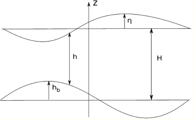
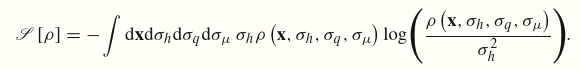
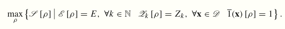

class: center, middle

# Statistical Mechanics of Geophysical Flows

## Ashwin Vishnu Mohanan

<!-- ### Slides: [ashwinvis.github.io/talks](https://ashwinvis.github.io/talks) -->

&nbsp;
All text in this presentation is licensed under a 
<a rel="license"
href="http://creativecommons.org/licenses/by/4.0/">Creative Commons Attribution
4.0 International License</a>. Images and screenshots are copyright material.

???
FIXME: add raw notes

---

layout: false

# Overview

* Theory

* Results from the literature:
  * 2D Turbulence: Kraichnan (1967), Miller (1990), Robert & Sommeria (1992)

  * Shallow water turbulence: Warn (1986), Renaud et al. (2016)

???
- Available CSS classes are: left-column, right-column, pull-left, pull-right
- Latex inline: \\( \\), newline \\[ \\]

---

class: center, middle, inverse

# Theory

---

# 1-layer shallow water equations

.left-column[

Fluid surface

Bottom

]
.right-column[

Simple 2D model, useful for explaining geophysical phenomena.

$$\partial_t {\mathbf{u}} = - ({\mathbf{u}}.\nabla) {\mathbf{u}} -
g \nabla (h + h_b) -
f\mathbf{e_z} \times {\mathbf{u}} $$

$$\partial_t h = - \nabla \cdot (h {\mathbf{u}})$$

- where,

  + \\({\mathbf{u}}=\\) horizontal velocity vector,
  + \\(g           =\\) acceleration due to gravity (related to wave speed),
  + \\(f          =\\) Coriolis parameter (twice the angular velocity of Earth),
  + \\(h  =\\) height of fluid

]

---
# Properties of shallow water equations

- Invariants:
  + mass \\(h \mathbf{u} \\),
  + **energy** \\(E = E_K + E_P\\)  (kinetic and potential energy) 
  + **potential vorticity**, \\(q = (\omega + f)/h\\) and its higher powers

- Compared to **2D euler equations** or
  **Quasi-Geostrophic equations** (Euler equations + coriolis force):

  + Admits gravity waves

- Velocity can be split using Helmholtz decomposition:
  $${\bf u} = \bf{u}_r + \bf{u}_d$$
  where,
    + \\({\bf u}_r = -\nabla \times ( {\bf e_z} \psi) \\) is the rotational component
    + \\(\bf {u}_d = \nabla \phi \\) is the divergent component

---

class: center, middle, inverse

# Results from literature

---

## Kraichnan (1967) - Inertial ranges in two-dimensional turbulence

- **2D turbulence** unlike Kolmogorov's **3D turbulence** theory:
   **vorticity** and **enstrophy** conservation also plays a strong constraint
   on cascade

- Constant enstrophy flux \\( \eta \\) would admit an extra inertial range.
  Dual cascade:
  $$E(k) \sim \epsilon^{2/3}k^{-5/3},\quad E(k) \sim \eta^{2/3}k^{-3}$$

- Cascade Directions

  - Argued by by analysing transfer term which involves triad interactions of
      wavenumbers \\( (k, p, q) \\)

  $$ (\partial_t + 2\nu k^2) E(k,t) = \int \int  T(k, p, q) dp dq$$
  - \\(k^{-5/3}\\) range: constant energy flux, **inverse** cascade
  - \\(k^{-3}\\) range: constant enstrophy flux, **forward** cascade

---

## Bouchet & Vennaile (2012) - Statistical mechanics of 2D and geophysical flows (review paper)

- **Miller (1990), Robert & Sommeria (1992)**: formulated equillibrium statistical mechanics providing a Liouville theorem and expression for entropy:

$$ S = \int d^2 r \int d\sigma \rho \ln \rho $$

  where \\( \rho \\) is the pdf of the enstrophy \\( \sigma \\) within a
  distance \\( r \\).

- As an explanation for stability of the great red spot of Jupiter
  - Constant potential vorticity core, surrounded by shear

---

## Warn (1986) - Statistical mechanical equilibria of the shallow water equations

- Built upon ideas of Kraichnan (1967) etc. to include effects of small scale
    inertio-gravity waves or *ageostrophic modes*.

- Considered quadratic constraints constructed from eigenmodes of the
    linearised shallow-water system.

    $$W = \\{ u, v, \eta \\}; \; W = \sum_{k,\alpha} A_k^{\alpha}(t) W_k^{\alpha}
    \exp \left(i \mathbf{k} \cdot \mathbf{r} \right) $$

- Proof for Liouville theorem by expanding the triad interaction coefficients
    in terms of eigenmodes, which in turn determines rate of change of the
    coefficients \\( A_k^\alpha \\).

    $$ A_k^\alpha = a_k^\alpha + i b_k^\alpha $$

    $$
     \begin{aligned}
     \frac{\partial \dot{a}_k^\alpha }{\partial a_k^\alpha} + 
     \frac{\partial \dot{b}_k^\alpha }{\partial b_k^\alpha}
     =2 \Re \frac{\partial \dot{A}_k^\alpha }{\partial A_k^\alpha}
     =0
     \end{aligned}
    $$

- Studying the evolution of rotational \\( R \\) and inertio-gravity modes
  \\( G \\) showed using multiple times scales:
   - **Slow manifold**: For short time scales \\( \tau = \epsilon t \\), only surviving resonant
   interactions are rotational and the motion is quasi-geostrophic
   - **Forward energy cascade**: Evolution into a wave energy cascade and
   equipartition spectrum requires extraction of energy from the rotational modes. Studied using a Langevin equation of \\(G\\).

---
## Renaud et al. (2016) - Equilibrium Statistical Mechanics and Energy Partition for the Shallow Water Model

- Generalized and built upon previous studies in the context of shallow water
equations.

- Proved Liouville theorem for a triplet \\(h, hu,  hv \\) and
transformed the result into \\(h, q, \mu \\) 

- Using a discrete grid and a microcanonical ensemble of microstates in
  \\( \\{ I_n, J_n, h_n, q_n, \mu_n \\}\\) a macrostate entropy was derived. In
  the continuous limit:
  
  in the absence of height variations / divergence it is
  equivalent to Miller-Robert-Sommeria's form.

- By constructing the variational problem of entropy maximization under
  constraints of conserved invariants:
  
  - Equipartition between kinetic and potential energy
  - Study of two subsystems: mean flow and fluctuations as a coupled
  variational problem
  - Simplified variational problem on quasi-geostrophic pdf equivalent to
  Miller-Robert-Sommeria's expression.

---

class: center, middle, inverse

# Thank you for your attention!

### Any questions?

## slides will be uploaded: [ashwinvis.github.io/talks](https://ashwinvis.github.io/talks.html)

---

# References

1. Bouchet, F., and A. Venaille. “Statistical Mechanics of Two-Dimensional and Geophysical Flows.” Physics Reports 515, no. 5 (June 2012): 227–95. https://doi.org/10.1016/j.physrep.2012.02.001.
1. Chavanis, P. H., and J. Sommeria. “Statistical Mechanics of the Shallow Water System.” Physical Review E 65, no. 2 (January 14, 2002): 026302. https://doi.org/10.1103/PhysRevE.65.026302.
1. Kraichnan, R. H. “Inertial Ranges in Two-Dimensional Turbulence.” Phys. Fluids 10, no. 7 (1967): 1417–23. https://doi.org/10.1063/1.1762301.
1. Miller, J. “Statistical Mechanics of Euler Equations in Two Dimensions.” Physical Review Letters 65, no. 17 (October 22, 1990): 2137–40. https://doi.org/10.1103/PhysRevLett.65.2137.
1. Renaud, A., A. Venaille, and F. Bouchet. “Equilibrium Statistical Mechanics and Energy Partition for the Shallow Water Model.” Journal of Statistical Physics 163, no. 4 (May 2016): 784–843. https://doi.org/10.1007/s10955-016-1496-x.
1. Robert, R., and J. Sommeria. “Relaxation towards a Statistical Equilibrium State in Two-Dimensional Perfect Fluid Dynamics.” Physical Review Letters 69, no. 19 (November 9, 1992): 2776–79. https://doi.org/10.1103/PhysRevLett.69.2776.
1. Warn, T. “Statistical Mechanical Equilibria of the Shallow-Water Equations.” Tellus Ser. A-Dyn. Meteorol. Oceanol. 38, no. 1 (1986): 1–11.

???
Copied from Zotero (Copy Bibliography)

